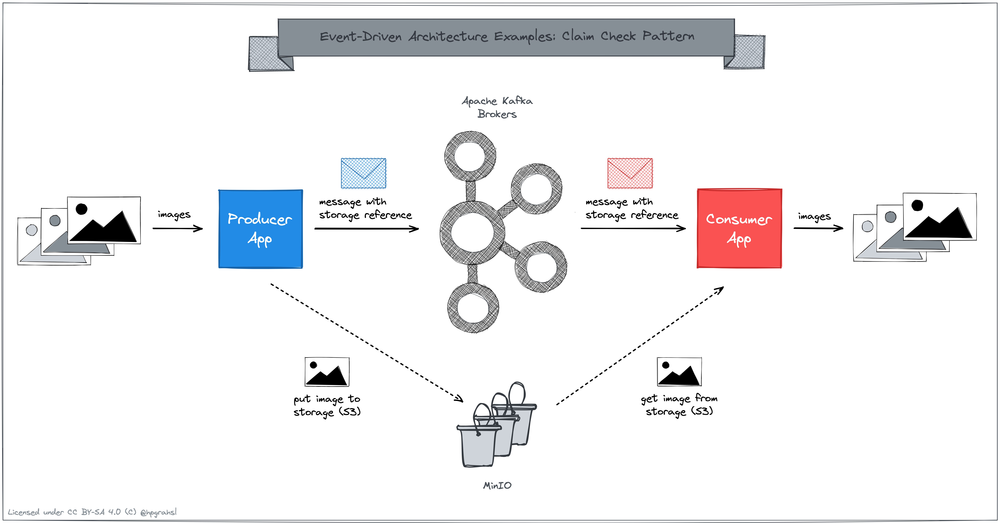

# Event-Driven Architecture Patterns

## Claim Check Pattern Example

The _claim check pattern_ pattern comes in very handy when applications need to communicate larger events to downstream consumers. The core idea is not to directly send larger objects (e.g. images, videos, documents, ...) as part of the payload across messaging or event streaming infrastructure. Instead, the large message is split into two parts:

1. **claim check:** some unique identifier to a database record or more appropriately a reference to an object in some storage service

2. **actual data:** the raw, often binary data which is offloaded to storage solutions such as Amazon S3, Azure Blob Storage, or Google Cloud Storage

The major benefit with this approach is that neither the messaging infrastructure nor the downstream client application are negatively impacted due to the direct transfer of large objects within event payloads. Additionally, it can be considerably more cost effective to decouple the storage layer from the processing layer when building data- and event-driven applications.

### Example Overview

The repository hosts a basic example which shows how to apply the _claim check pattern_ to send images from one application to another. Apache Kafka is used as the event streaming platform in between which allows to decouple this data flow. MinIO serves as an S3-compatible storage service and is used to store the actual binary data for all images. The illustration below shows a high-level overview:



### Implementation Details

* Both, the producer and consumer are simple [Apache Kafka](https://kafka.apache.org) client applications which are implemented based on [Quarkus](https://quarkus.io).

* The actual work of externalizing the large message payloads - images in this example - is delegated to a specific Kafka [Serde implementation](https://github.com/bakdata/kafka-large-message-serde) which allows to send and retrieve data to and from storage services such as S3.

* [MinIO](https://min.io/) is used as self-hosted and S3 compatible storage service to store all the raw data for images

### How to run it?

There are two different ways to run this example scenario.

#### **Docker Compose**

In case you want to run this locally, simply go in to the folder `eda-cpp/docker` and run `docker compose up` in your terminal. All components will start and after a couple of moments, you should see log output from the `eda-ccp-producer` and `eda-ccp-consumer` showing that images are produced to / consumed from a Kafka topic. Since the logs are interleaved in the main docker compose window, it's easier to inspect the logs in separate terminal windows as follows:

`docker compose logs eda-ccp-producer`

```log
...

eda-ccp-producer  | 2023-02-07 13:54:39,514 INFO  [com.rh.dev.ImageProducer] (main) start to produce records to topic my_image_stream_topic...
eda-ccp-producer  | 2023-02-07 13:54:39,517 INFO  [com.rh.dev.ImageProducer] (main) producing data for image: /home/data/images/dawson-lovell-W_MUqtuHwyY-unsplash.jpg
eda-ccp-producer  | 2023-02-07 13:54:42,466 INFO  [com.rh.dev.ImageProducer$1] (kafka-producer-network-thread | producer-1) meta data: Topic:my_image_stream_topic Partition: 0 Offset: 0 Timestamp: 1675778081204
eda-ccp-producer  | 2023-02-07 13:54:43,280 INFO  [com.rh.dev.ImageProducer] (main) producing data for image: /home/data/images/cristofer-maximilian-uQDRDqpYJHI-unsplash.jpg
eda-ccp-producer  | 2023-02-07 13:54:43,382 INFO  [com.rh.dev.ImageProducer$1] (kafka-producer-network-thread | producer-1) meta data: Topic:my_image_stream_topic Partition: 0 Offset: 1 Timestamp: 1675778083285
...
```

`docker compose logs eda-ccp-consumer`

```log
...

eda-ccp-consumer  | 2023-02-07 13:54:39,417 INFO  [com.rh.dev.ImageConsumer] (main) start to consume records from topic my_image_stream_topic...
eda-ccp-consumer  | 2023-02-07 13:54:43,349 INFO  [com.rh.dev.ImageConsumer] (main) consumed image with key /home/data/images/dawson-lovell-W_MUqtuHwyY-unsplash.jpg -> 'execute business logic...'
eda-ccp-consumer  | 2023-02-07 13:54:45,150 INFO  [com.rh.dev.ImageConsumer] (main) IMAGE META DATA -> width: 1330 | height: 1980 | size: 768426
eda-ccp-consumer  | 2023-02-07 13:54:45,222 INFO  [com.rh.dev.ImageConsumer] (main) consumed image with key /home/data/images/cristofer-maximilian-uQDRDqpYJHI-unsplash.jpg -> 'execute business logic...'
eda-ccp-consumer  | 2023-02-07 13:54:46,599 INFO  [com.rh.dev.ImageConsumer] (main) IMAGE META DATA -> width: 1320 | height: 1980 | size: 417013
...
```

In contrast, any Kafka client which hasn't been configured to use the specific Serde implementation only sees the storage reference in the consumed Kafka record's value. By checking the logs for the standard `kafka-console-consumer` this becomes evident:

`docker compose logs console-consumer`

```log
...

console-consumer  | /home/data/images/dawson-lovell-W_MUqtuHwyY-unsplash.jpg -> s3://eda-ccp-s3/my_image_stream_topic/values/3cf67bd1-fdc9-49f1-beca-1eca7ce27af8
console-consumer  | /home/data/images/cristofer-maximilian-uQDRDqpYJHI-unsplash.jpg -> s3://eda-ccp-s3/my_image_stream_topic/values/0dc19216-162c-430d-b9a9-297b080d7cec
...
```


#### **Kubernetes**

In case you want to run this example in a Kubernetes environment, there are ready-made YAML manifests you can directly apply to your k8s cluster.

1. Make sure your `kubectl` context is configured properly. 
2. Then go into the main folder of the example `eda-cpp` and simply run `kubectl apply -f k8s` in your terminal.
3. All contained `.yaml` files - for infra and app components -  will get deployed into your configured cluster.

After a few moments, everything should be up and running fine:

`kubectl get pods`

```bash
NAME                                READY   STATUS      RESTARTS   AGE
console-consumer-67bfc979c4-rqxs4   1/1     Running     0          62s
eda-ccp-consumer-9bf7f9978-9crwt    1/1     Running     0          62s
eda-ccp-producer-76b4f975c4-x9f9p   1/1     Running     0          62s
kafka-67cbf4cd74-wlnpm              1/1     Running     0          60s
minio-6757448989-2n4fc              1/1     Running     0          58s
minio-bucket-init-f8bkl             0/1     Completed   0          58s
zookeeper-59f5fb6dff-xtc8b          1/1     Running     0          61s
```

By checking the logs, you can inspect what happens in the applications. **Note, that you need to change the pod names accordingly** to match those reflected in your environment:

`kubectl logs -f eda-ccp-producer-76b4f975c4-x9f9p`

```log
...

2023-02-07 14:21:01,050 INFO  [com.rh.dev.ImageProducer] (main) producing data for image: /home/data/images/sebastian-unrau-sp-p7uuT0tw-unsplash.jpg
2023-02-07 14:21:01,076 INFO  [com.rh.dev.ImageProducer$1] (kafka-producer-network-thread | producer-1) meta data: Topic:my_image_stream_topic Partition: 0 Offset: 1 Timestamp: 1675779661051
2023-02-07 14:21:02,570 INFO  [com.rh.dev.ImageProducer] (main) producing data for image: /home/data/images/cristofer-maximilian-uQDRDqpYJHI-unsplash.jpg
2023-02-07 14:21:02,592 INFO  [com.rh.dev.ImageProducer$1] (kafka-producer-network-thread | producer-1) meta data: Topic:my_image_stream_topic Partition: 0 Offset: 2 Timestamp: 1675779662575
...
```

`kubectl logs -f eda-ccp-consumer-9bf7f9978-9crwt`

```log
...

2023-02-07 14:21:00,677 INFO  [com.rh.dev.ImageConsumer] (main) consumed image with key /home/data/images/josh-hild-_TuI8tZHlk4-unsplash.jpg -> 'execute business logic...'
2023-02-07 14:21:01,333 INFO  [com.rh.dev.ImageConsumer] (main) IMAGE META DATA -> width: 1584 | height: 1980 | size: 562255
2023-02-07 14:21:01,365 INFO  [com.rh.dev.ImageConsumer] (main) consumed image with key /home/data/images/sebastian-unrau-sp-p7uuT0tw-unsplash.jpg -> 'execute business logic...'
2023-02-07 14:21:01,792 INFO  [com.rh.dev.ImageConsumer] (main) IMAGE META DATA -> width: 1980 | height: 1320 | size: 571989
...
``` 

In contrast, any Kafka client which hasn't been configured to use the specific Serde implementation only sees the storage reference in the consumed Kafka record's value. By checking the logs for the standard `kafka-console-consumer` this becomes evident:

`kubectl logs -f console-consumer-67bfc979c4-rqxs4`

```log
...

/home/data/images/josh-hild-_TuI8tZHlk4-unsplash.jpg -> s3://eda-ccp-s3/my_image_stream_topic/values/40810d79-9e91-4520-ae0b-5fa1c769726e
/home/data/images/sebastian-unrau-sp-p7uuT0tw-unsplash.jpg -> s3://eda-ccp-s3/my_image_stream_topic/values/3befcabc-666d-4498-8cda-59405cf3f3cc
...
```
